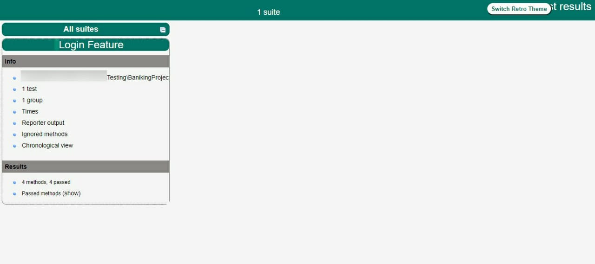
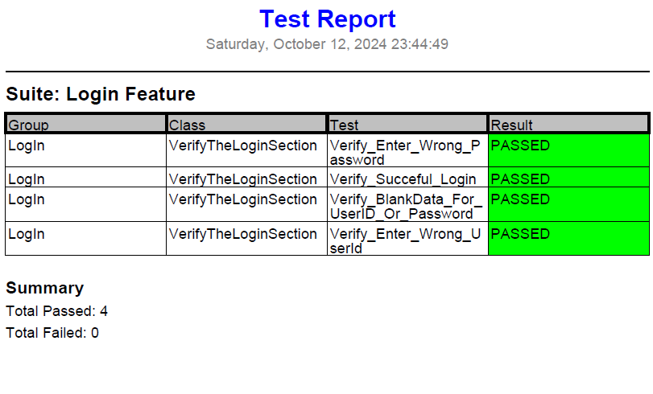

# Banking Project

This project is a banking application that includes automated tests using Selenium and TestNG. It will have a continuous  update for automation scripts according to tasks which will be send by [guru99](https://www.guru99.com/) 

The Demo Project is based on Live Selenium Project: [Banking Domain](https://www.demo.guru99.com/V4/index.php)

## Project Structures

- You Can find all test scripts under [Test Directory](./src/test/java)
- [TestNG.xml](./TestNG.xml) File : Is the configuration file for TestNG to control the way of running  test suites, test groups, and test methods in a structured and organized manner.
- [POM.xml](./POM.xml) File : Project Object Model file used by Maven to manage the project's build, dependencies, and other configurations.
- [Project-Tasks](.\Project-Tasks\) Directory: This is a project directory which contain the daily requirements from me
- [Test-Output](./test-output/) Directory: You can find all generated HTML reports that generated by TestNg for Test cases example [index.html](.\test-output\index.html)
  - 

- After run TestNG.xml , I create a PDF Generator Report Class which convert the state of tests cases into a pdf file you can find it [Test-Reports](./\test-reports\)  
  * 

## How Run the Tests

1. **Build the Project**:
   
   ```shell
    mvn clean install -U
   ```

2. Run the project

   ```shell
   mvn test
   ```

   